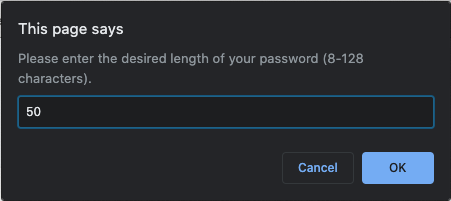
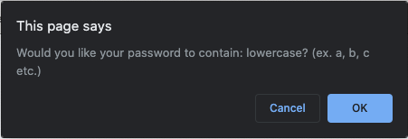
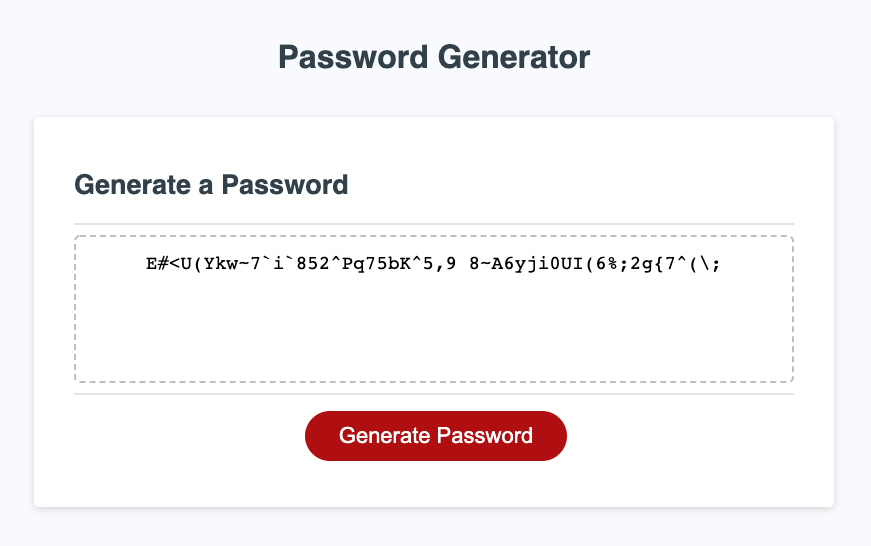

# Password Generator

[Link to Repository](https://github.com/zehrl/password-generator)

[Link to Website](https://zehrl.github.io/password-generator/)

---

## Instructions & Usage
1. Begin by navigating to the .io link here
1. Click the "Generate Password" button
1. You will now be prompted with a series of questions such as, "How many characters would you like in the password?" and "Would you like lowercase characters in the password?"



4. Select "Ok" for yes and "Cancel" for no



5. After answering all prompts, your password will be displayed in the main form



---
## Customer Requirements

```
GIVEN I need a new, secure password
WHEN I click the button to generate a password
THEN I am presented with a series of prompts for password criteria

WHEN prompted for password criteria
THEN I select which criteria to include in the password

WHEN prompted for the length of the password
THEN I choose a length of at least 8 characters and no more than 128 characters

WHEN prompted for character types to include in the password
THEN I choose lowercase, uppercase, numeric, and/or special characters

WHEN I answer each prompt
THEN my input should be validated and at least one character type should be selected

WHEN all prompts are answered
THEN a password is generated that matches the selected criteria

WHEN the password is generated
THEN the password is either displayed in an alert or written to the page
```


---
## Development

The method I used to conceptualize the code was through a flow chart found on the link below:
https://www.zenflowchart.com/docs/view/k1oYq9wdL9JrAejPXgEB


Basic flowchart sequence
- Ask user for password character count
- Ask user to select 1 or more of each data type: lowercase, uppercase, numeric, special characters
- Generate 4 arrays that hold all available characters for each data type (ex. lowercaseArray = ["a", "b",...,"z"]).
- Generate random number (1-4) that corresponds to each data type (ex. 1 = lowercase, 2 = uppercase etc.)
- When an array is selected, there is then another random number generated based on the number elements in the array.
- An empty string is appended with the chosen, random character from the array.
- Continue adding random array characters until the character count condition is met.
- Display final password string on form

### but wait... how did you enforce your code to include every data type?
By adding sneaky boolean variables that keep track of the used character types, I was able to check to see if I was meeting the condition when building the password string. Essentially, when I would enter a lowercase character to the string, I would assign a variable "hasLowercase" a value of true. By comparing how many characters I would need to finish the string and how many different data types I would require, i was able to tell the code, "Hey, start adding uppercase, because we don't have any of those in the password yet."

---
## License

Copyright (c) 2020 Logan Joseph Zehr

Permission is hereby granted, free of charge, to any person obtaining a copy of this software and associated documentation files (the "Software"), to deal in the Software without restriction, including without limitation the rights to use, copy, modify, merge, publish, distribute, sublicense, and/or sell copies of the Software, and to permit persons to whom the Software is furnished to do so, subject to the following conditions:

The above copyright notice and this permission notice shall be included in all copies or substantial portions of the Software.

THE SOFTWARE IS PROVIDED "AS IS", WITHOUT WARRANTY OF ANY KIND, EXPRESS OR IMPLIED, INCLUDING BUT NOT LIMITED TO THE WARRANTIES OF MERCHANTABILITY, FITNESS FOR A PARTICULAR PURPOSE AND NONINFRINGEMENT. IN NO EVENT SHALL THE AUTHORS OR COPYRIGHT HOLDERS BE LIABLE FOR ANY CLAIM, DAMAGES OR OTHER LIABILITY, WHETHER IN AN ACTION OF CONTRACT, TORT OR OTHERWISE, ARISING FROM, OUT OF OR IN CONNECTION WITH THE SOFTWARE OR THE USE OR OTHER DEALINGS IN THE SOFTWARE.